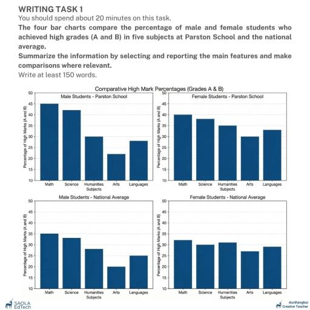

# IELTS - Official Computer-Delivered Exam - 29th Aug

> **Exam Type**: Computer-Delivered IELTS Academic (Official Test)  
> **Official Score Achieved**: Overall Band 8.0 (Listening: 9.0, Reading: 7.5, Writing: 7.5, Speaking: 7.0)  

---

## Task 1 – Academic Performance at Parston School vs. National Average

**“The four bar charts compare the percentage of male and female students who achieved high grades (A and B) in five subjects at Parston School and the national average. Summarize the information by selecting and reporting the main features, and make comparisons where relevant.”**

Word Count: **194**

---

### Report

The four bar charts compare the proportions of male and female students achieving high academic marks (Grades A and B) across five subjects at Parston School with the corresponding national benchmarks.

Overall, students at Parston School consistently outperformed their national peers in every subject, regardless of gender. Furthermore, while male students achieved their highest marks in Mathematics and Science, female students demonstrated a more balanced academic performance across all disciplines, maintaining higher success rates in Humanities, Languages, and Arts.

In Mathematics and Science, male students recorded the highest academic attainment. At Parston School, 45% of boys attained A and B grades in Math and 42% in Science, outperforming the national male averages of 35% and 33% respectively. Parston girls also performed strongly in these disciplines, with 40% securing top grades in Math and 38% in Science, compared to national female figures of 32% and 30%.

Conversely, female students generally surpassed males in the remaining subjects. At Parston School, 35% of girls achieved high marks in Humanities, 33% in Languages, and 30% in Arts, compared to 30%, 28%, and 22% for boys. A parallel pattern was evident nationally, where girls led boys in Humanities (31% to 28%), Languages (29% to 25%), and Arts (27% to 20%).

---

## Task 2 – The Rise of Mega-Cities

**“Research shows that increasing numbers of people are now living in mega-cities: cities of more than 20 million inhabitants. Is this a positive or negative development?”**

Word Count: **302**

---

### Essay

Demographic research indicates a pronounced global migration toward mega-cities—urban conglomerates boasting populations in excess of twenty million residents. While these hyper-dense metropolises serve as powerful engines of economic prosperity and technological innovation, I contend that the associated infrastructural strain, ecological degradation, and diminished quality of life make this predominantly a negative development.

On the one hand, mega-cities generate undeniable economic agglomeration advantages. By concentrating human capital, international corporations, and elite research institutions in a single geographical hub, these metropolises accelerate industrial innovation and commercial growth. Residents benefit from a vast array of specialized employment opportunities, world-class healthcare facilities, and premier universities that smaller regional towns cannot sustain. Furthermore, dense urbanization can foster cosmopolitan cultural ecosystems and attract substantial foreign direct investment, driving national economic expansion.

On the other hand, the unfettered expansion of cities beyond twenty million inhabitants creates acute socioeconomic and environmental crises. Foremost among these is the overwhelming pressure exerted on public infrastructure. Public transit networks, water supplies, and sanitation systems frequently collapse under such demographic loads, resulting in chronic traffic congestion and severe utility shortages. Moreover, skyrocketing real estate costs in mega-cities make decent housing unaffordable for average wage earners, fostering the expansion of informal settlements and widening economic disparity. Compounding these structural deficits is severe environmental pollution; vehicular emissions, industrial waste, and the urban heat island effect impose catastrophic health costs on inhabitants, leading to chronic respiratory conditions and heightened psychological stress.

In conclusion, although mega-cities offer unparalleled career trajectories and centralized cultural amenities, their unchecked expansion beyond sustainable limits undermines human well-being and ecological equilibrium. Governments should therefore prioritize regional decentralization and secondary-city development rather than allowing unsustainable urban hyper-concentration.
