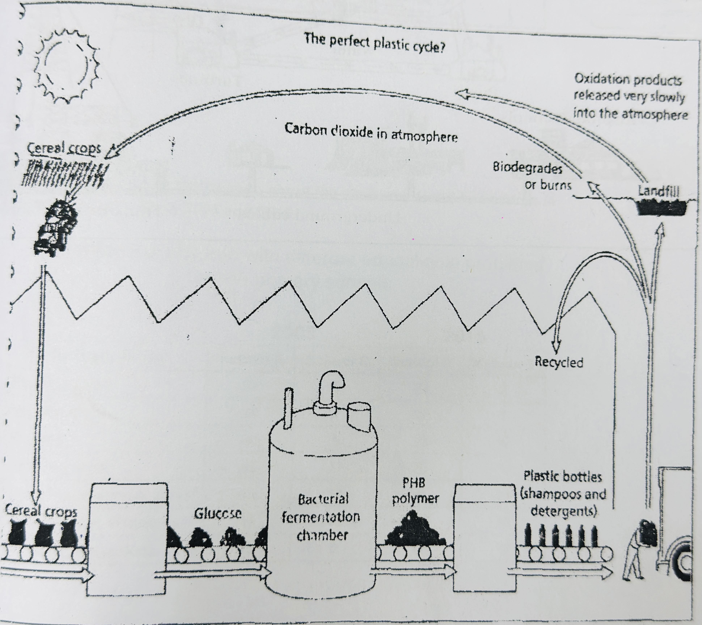

# IELTS T1|10 – Production and Breakdown of Bioplastics

**“Plastic litter is unsightly and appears never to rot away. Now chemists have produced a plastic that is made from sugar by bacteria and when discarded can be digested by other bacteria in the solid to form carbon dioxide. As a class assignment you have been asked to write a description of how this plastic is produced and then broken down. Using the information in the diagram, write a description of the cycle. You may use your own knowledge and experience in addition to the diagram.”**

Word Count: **182**

---

## Report

The diagram illustrates the production of a biodegradable plastic from cereal crops and the processes through which it is eventually broken down and returned to the atmosphere. 

Overall, the cycle begins with cereal crops, which are processed to produce glucose. This is then fermented by bacteria to create a PHB polymer, which is subsequently manufactured into plastic products such as bottles. After use, these products can either be recycled or disposed of in landfill, where they are degraded or burned.

Initially, cereal crops are processed to obtain glucose, which is fed into a bacterial fermentation chamber. The bacteria convert the glucose into a PHB polymer which is then used to manufacture plastic bottles for products such as shampoos and detergents. Once these bottles have been used, they can be recycled and returned to the production process.

Alternatively, discarded plastic can be sent to landfill. There, bacteria can biodegrade it, while it may also be burned. These processes produce oxidation products that are released slowly into the atmosphere, including carbon dioxide. The carbon dioxide is subsequently absorbed by cereal crops, completing the cycle.
