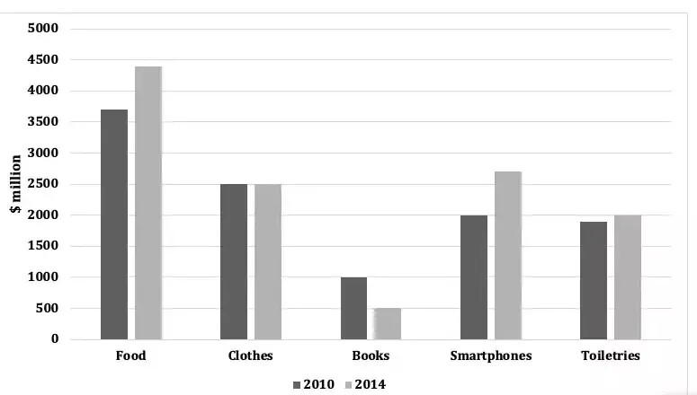

# IELTS T1|02 – Spending Habits of Young Adults

**“The chart below shows the spending (in millions) by 18-20 year olds in one country on five different products in 2010 and 2014. Summarise the main features, and make comparisons where relevant.”**

Word Count: **165**

---

## Report

The bar chart compares the expenditure patterns of 18-to-20-year-olds in a specific nation across five product categories in 2010 and 2014, measured in millions of dollars.

Overall, food consistently accounted for the highest expenditure in both years, whereas books represented the lowest. While spending on food and smartphones experienced substantial growth over the four-year period, expenditure on books dropped precipitously. In contrast, spending on clothing and toiletries remained relatively stable.

In 2010, young consumers spent approximately $3.7 million on food, a figure that climbed significantly to nearly $4.4 million by 2014. Similarly, expenditure on smartphones witnessed notable growth, rising from $2.0 million to approximately $2.7 million. Meanwhile, outlay on clothes remained completely unchanged at $2.5 million across both recorded years.

Regarding the remaining categories, spending on toiletries rose marginally from just under $2.0 million in 2010 to exactly $2.0 million in 2014. Conversely, books experienced a marked decline, with expenditure halving from $1.0 million to just $0.5 million over the period.
