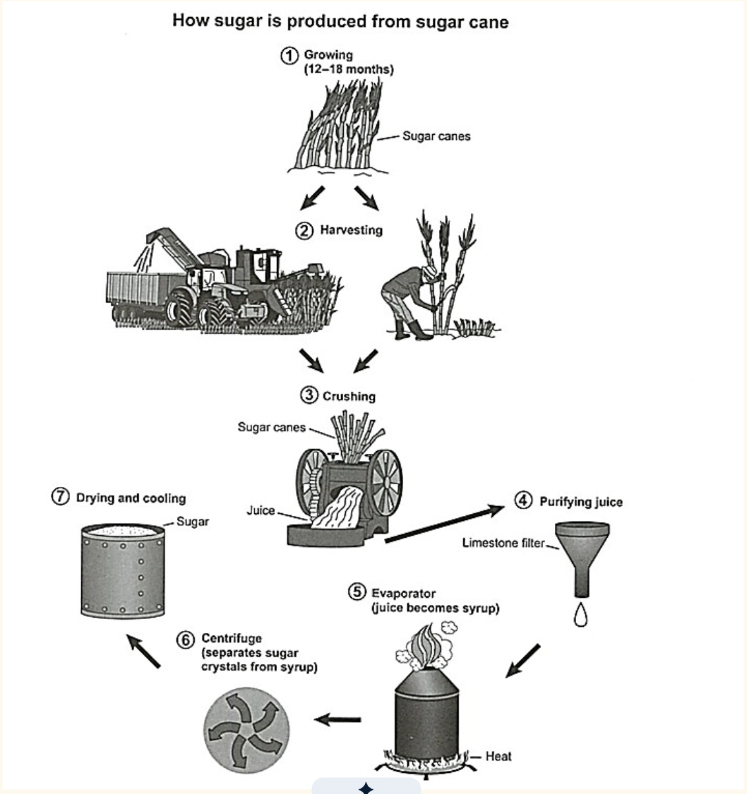

# IELTS T1|17 – Sugar Manufacturing Process

**“The diagram below shows the manufacturing process for making sugar from sugar cane. Summarize the information by selecting and reporting the main features, and make comparisons where relevant.”**

Word Count: **174**

---

## Report

The flow chart delineates the multi-stage linear process through which refined sugar is manufactured from raw sugar cane.

Overall, the production process comprises seven distinct, sequential stages, beginning with agricultural cultivation and mechanical harvesting, proceeding through chemical purification and thermal concentration, and culminating in centrifugal separation and drying.

At the initial stage, sugar cane is cultivated for approximately 12 to 18 months until it reaches maturity. Once fully grown, the stalks are harvested either manually by agricultural workers or mechanically using specialised harvesters. Following harvesting, the stalks are fed into a crushing mill, which presses the cane to extract raw juice. This liquid is subsequently directed through a limestone filter to remove impurities and purify the extract.

In the subsequent refining stages, the purified juice is placed into an evaporator, where heat is applied to evaporate water and transform the liquid into concentrated syrup. This syrup is then transferred to a centrifuge, which spins at high speed to separate solid sugar crystals from the remaining liquid syrup. Finally, the extracted crystals are dried and cooled to produce the finished commercial sugar.
