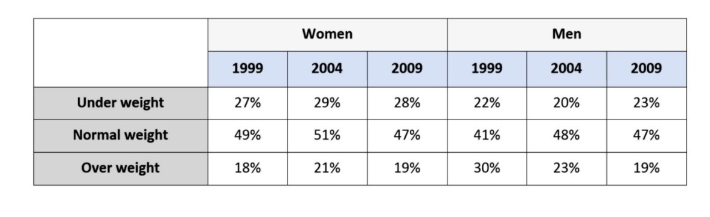

# IELTS T1|27 – Weight Categories by Gender

**“The table below shows the weight of people in a particular country from 1999 to 2009. Summarize the information by selecting and reporting the main features, and make comparisons where relevant.”**

Word Count: **203**

---

## Report

The provided table compares the proportions of men and women in a particular country who were classified in three different weight categories, over a decade from 1999 to 2009.

Overall, normal weight was the most common category among women throughout the period, while the proportion of overweight men declined considerably. By 2009, the figures for men and women in the normal-weight and overweight categories were notably similar.

Among women, the proportion who were underweight increased slightly from 27% in 1999 to 29% in 2004, before falling marginally to 28% in 2009. A similar pattern was observed among those of normal weight, with the figure rising from 49% to 51% and then decreasing to 47%. Meanwhile, the percentage of overweight women climbed from 18% in 1999 to 21% in 2004, before dropping slightly to 19% in 2009.

The most significant change among men was in the overweight category. The proportion fell sharply from 30% in 1999 to 19% in 2009. By comparison, the percentage of men with normal weight rose from 41% in 1999 to 48% in 2004, before declining slightly to 47% in 2009. The figure for underweight men followed the opposite trend, decreasing from 22% to 20% and subsequently rising to 23%.
